################################
PyRETIS - RETIS analysis
################################

RETIS analysis report generated by PyRETIS version 3.0.1
on 04.05.2026 22:17:58.

The main results are:

* The crossing probability:
  :math:`P_{\text{cross}} = 0.450679197  \pm  5.124929126 \%`

* The initial flux (unit: 1/gromacs):
  :math:`f_{A} = 14.653732118  \pm  3.770216695 \%`

* The rate constant (unit: 1/gromacs):
  :math:`k_{AB} = 6.604132220  \pm  6.362344888 \%`

.. _combined-results:

Combined results
================

The overall matched probability distributions are shown in the left figure
while the matched probability distribution is shown in the right figure below.
The overall crossing rate as a function of cycles
and its relative error block analysis are reported in the two following
plots, respectively.

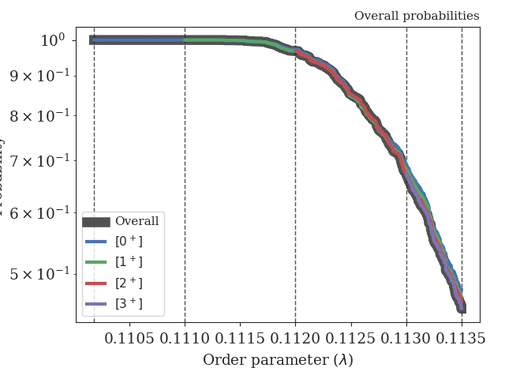
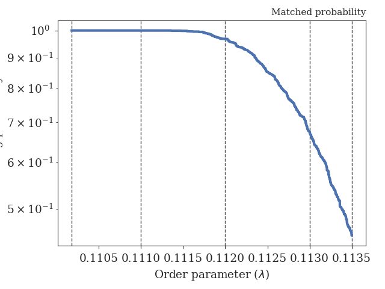
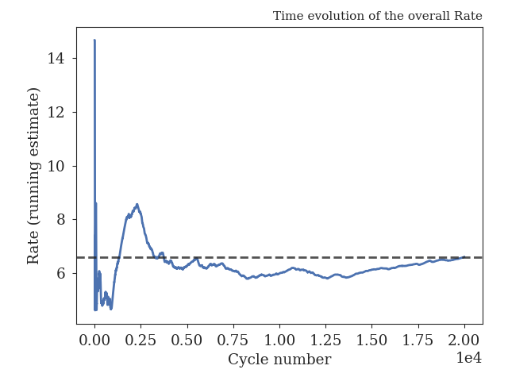
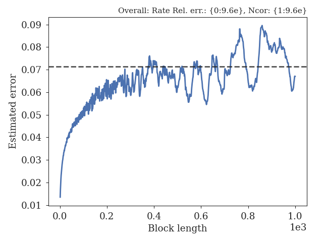

.. _figure-results:

Results for path ensembles
==========================

The following interfaces were used in the simulation (and analysis)
for calculating the crossing probabilities:

+-------------------------------------------+
|Interfaces                                 |
+----------+----------+----------+----------+
| Ensemble |   Left   |  Middle  |  Detect  |
+==========+==========+==========+==========+
|  [0^-]   |   -inf   |  0.1102  |          |
+----------+----------+----------+----------+
|  [0^+]   |  0.1102  |  0.1102  |  0.1110  |
+----------+----------+----------+----------+
|  [1^+]   |  0.1102  |  0.1110  |  0.1120  |
+----------+----------+----------+----------+
|  [2^+]   |  0.1102  |  0.1120  |  0.1130  |
+----------+----------+----------+----------+
|  [3^+]   |  0.1102  |  0.1130  |  0.1135  |
+----------+----------+----------+----------+

+-----------------------------------------------------+
|Crossing probabilities                               |
+----------+------------+------------+----------------+
| Ensemble |   Pcross   |   Error    | Rel. error (%) |
+==========+============+============+================+
|  [0^+]   |  1.000000  |  0.000000  |    0.000000    |
+----------+------------+------------+----------------+
|  [1^+]   |  0.967550  |  0.007795  |    0.805671    |
+----------+------------+------------+----------------+
|  [2^+]   |  0.696150  |  0.019681  |    2.827111    |
+----------+------------+------------+----------------+
|  [3^+]   |  0.669100  |  0.028089  |    4.198004    |
+----------+------------+------------+----------------+

+-------------------------------------------------------------------------------+
|Pathensemble data                                                              |
+----------+------------+------------------+-----------------+------------------+
| Ensemble | TIS cycles | Shoot acc. ratio | Swap acc. ratio | Avg. path length |
+==========+============+==================+=================+==================+
|  [0^-]   |   19993    |     0.688051     |    0.051466     |     3.000250     |
+----------+------------+------------------+-----------------+------------------+
|  [0^+]   |   20000    |     0.316530     |    0.523643     |     7.823950     |
+----------+------------+------------------+-----------------+------------------+
|  [1^+]   |   20000    |     0.335696     |    0.984272     |     7.724650     |
+----------+------------+------------------+-----------------+------------------+
|  [2^+]   |   20000    |     0.321389     |    0.830979     |     7.605900     |
+----------+------------+------------------+-----------------+------------------+
|  [3^+]   |   19997    |     0.472224     |    0.691905     |     8.123018     |
+----------+------------+------------------+-----------------+------------------+

.. _prob-figures-output:

Crossing probabilities
----------------------

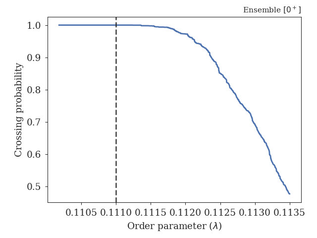
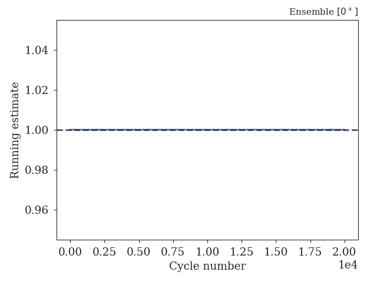
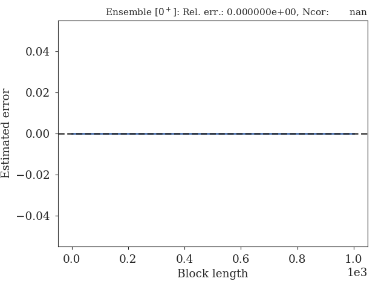

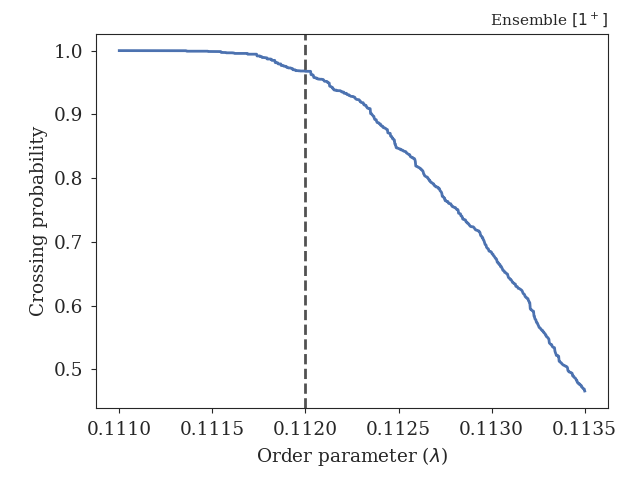
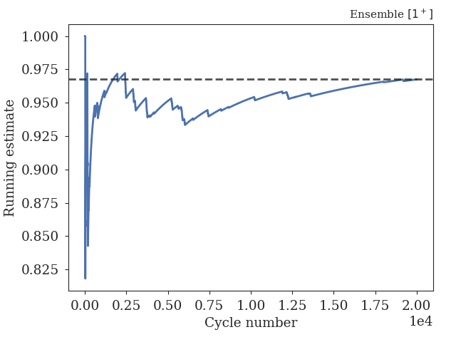
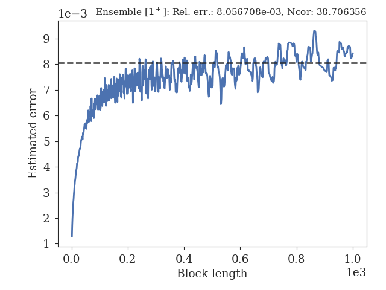

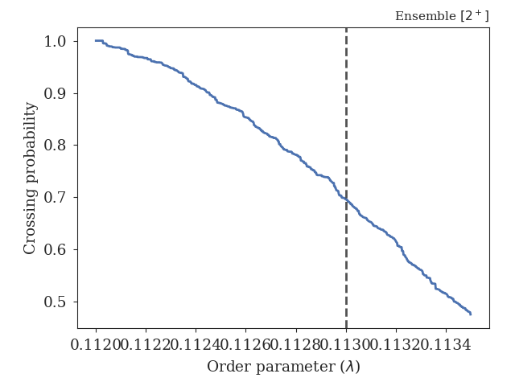
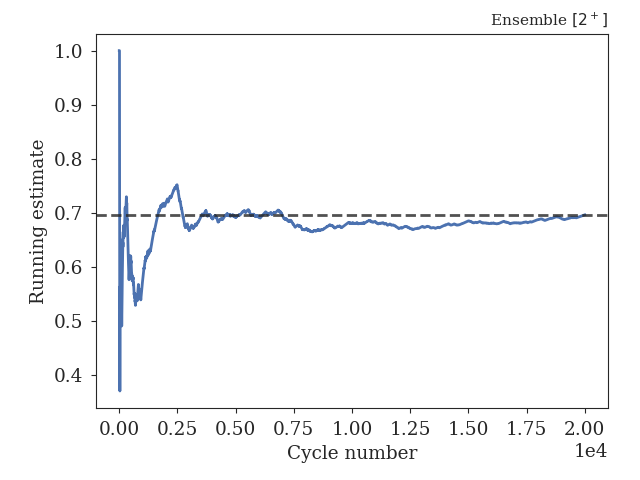
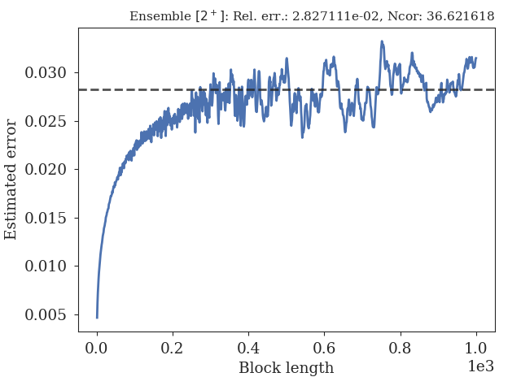

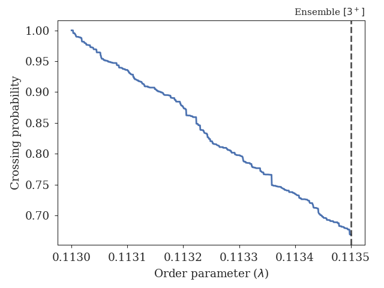
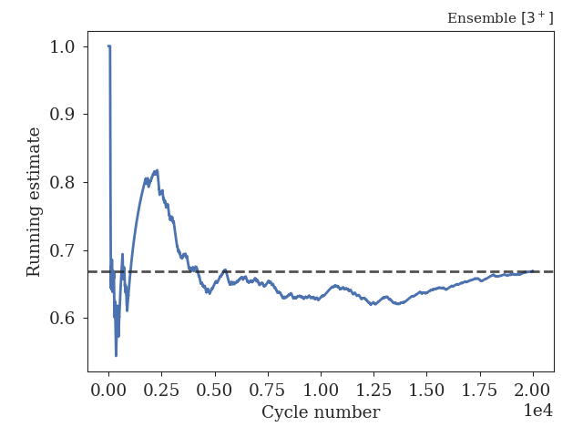
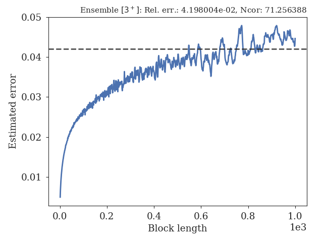

.. _len-shoot-figures-output:

Distributions for path lengths and shooting moves
-------------------------------------------------

The average path lengths in the different ensembles are given in
the table below and some distributions for the path lengths and
shooting moves can also be found here:

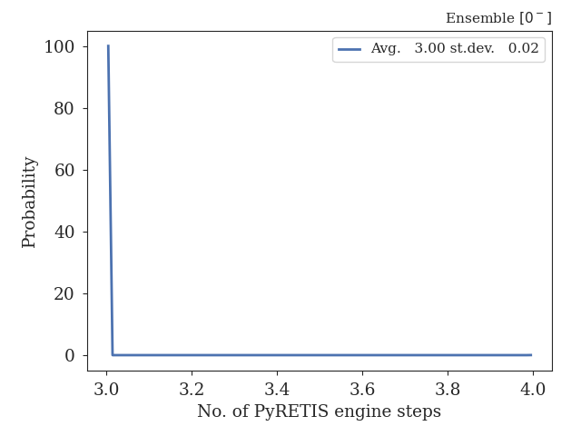
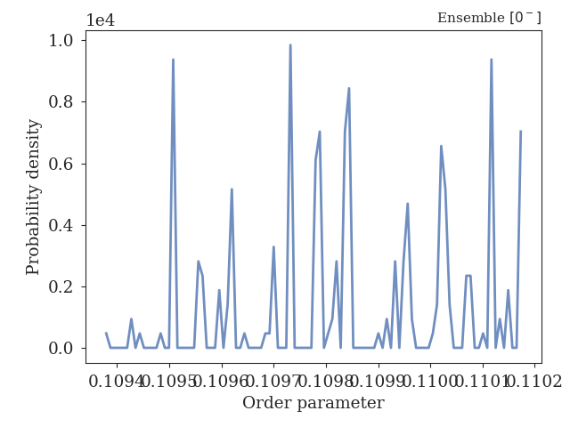

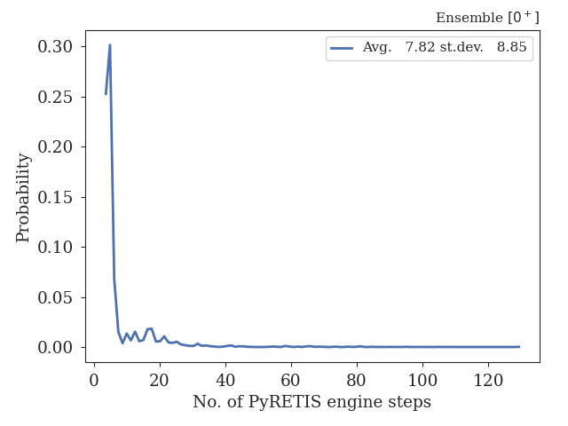
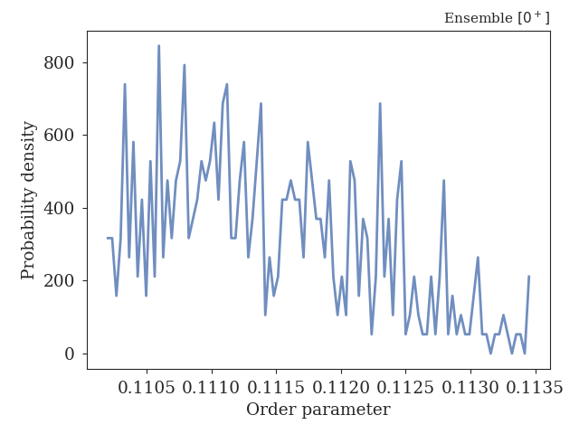

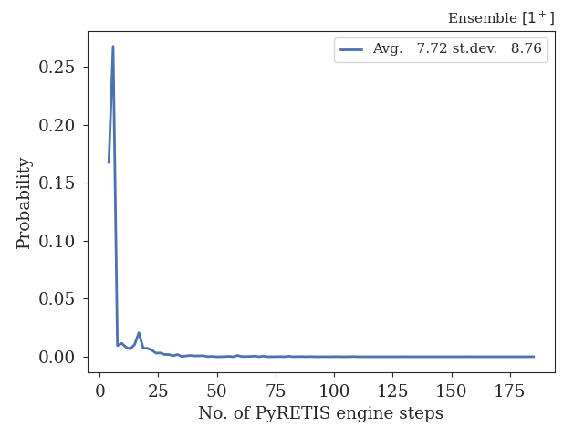
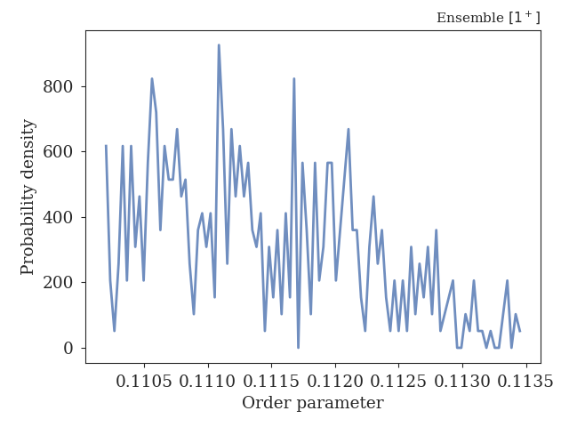

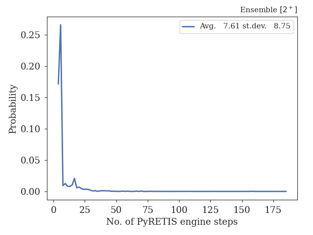
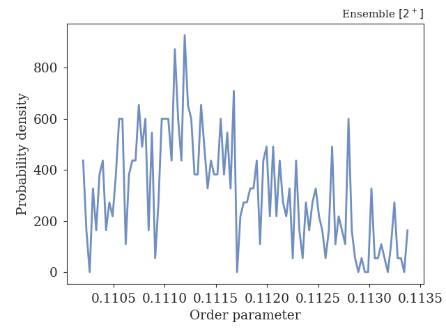

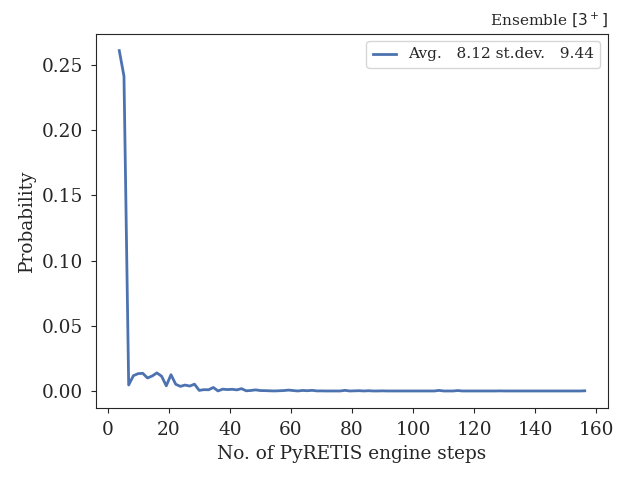
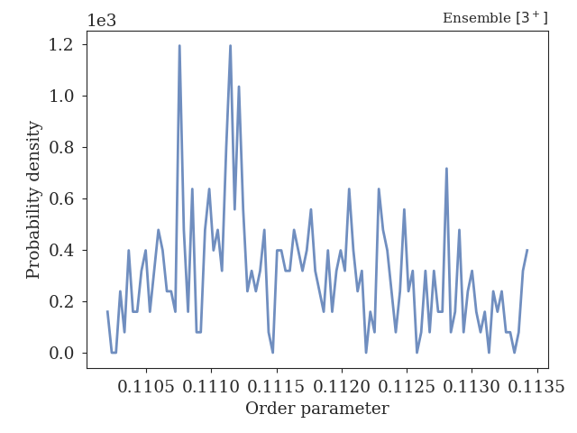

