################################
PyRETIS - RETIS analysis
################################

RETIS analysis report generated by PyRETIS version 3.0.1
on 04.05.2026 22:09:43.

The main results are:

* The crossing probability:
  :math:`P_{\text{cross}} = 0.599401446  \pm  2.575132024 \%`

* The initial flux (unit: 1/gromacs):
  :math:`f_{A} = 15.874304162  \pm  1.627010955 \%`

* The rate constant (unit: 1/gromacs):
  :math:`k_{AB} = 9.515080874  \pm  3.046058041 \%`

.. _combined-results:

Combined results
================

The overall matched probability distributions are shown in the left figure
while the matched probability distribution is shown in the right figure below.
The overall crossing rate as a function of cycles
and its relative error block analysis are reported in the two following
plots, respectively.

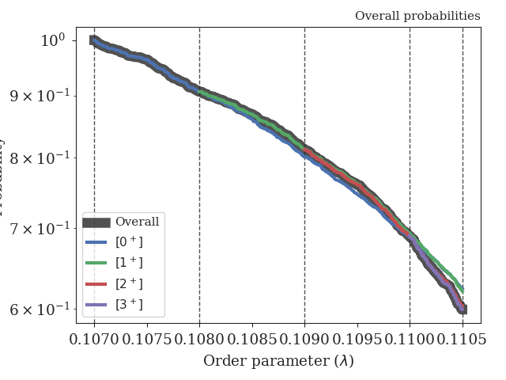
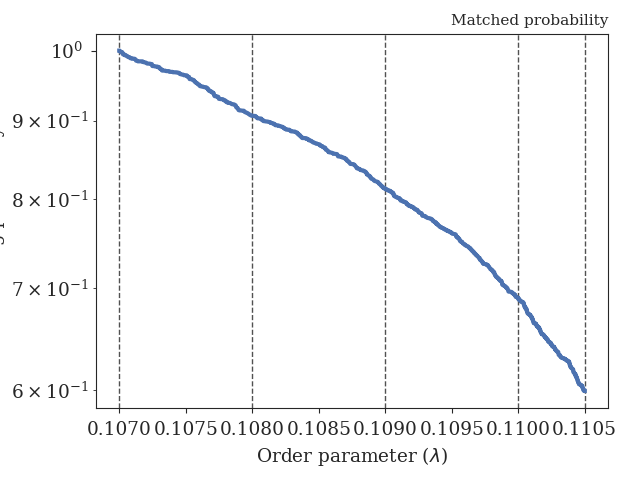
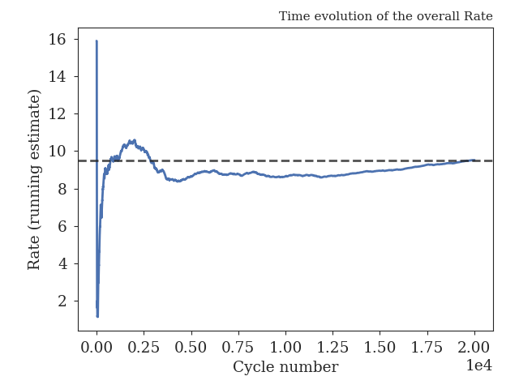
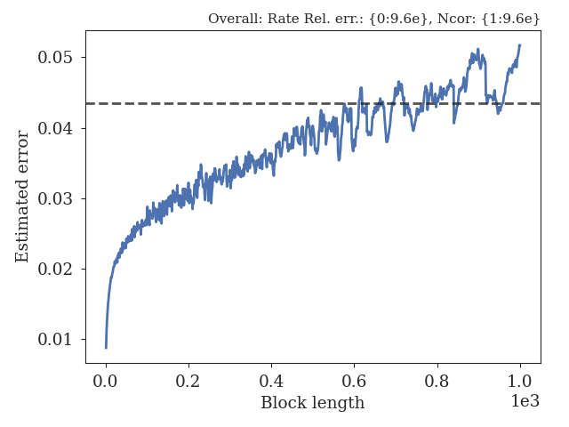

.. _figure-results:

Results for path ensembles
==========================

The following interfaces were used in the simulation (and analysis)
for calculating the crossing probabilities:

+-------------------------------------------+
|Interfaces                                 |
+----------+----------+----------+----------+
| Ensemble |   Left   |  Middle  |  Detect  |
+==========+==========+==========+==========+
|  [0^-]   |   -inf   |  0.1070  |          |
+----------+----------+----------+----------+
|  [0^+]   |  0.1070  |  0.1070  |  0.1080  |
+----------+----------+----------+----------+
|  [1^+]   |  0.1070  |  0.1080  |  0.1090  |
+----------+----------+----------+----------+
|  [2^+]   |  0.1070  |  0.1090  |  0.1100  |
+----------+----------+----------+----------+
|  [3^+]   |  0.1070  |  0.1100  |  0.1105  |
+----------+----------+----------+----------+

+-----------------------------------------------------+
|Crossing probabilities                               |
+----------+------------+------------+----------------+
| Ensemble |   Pcross   |   Error    | Rel. error (%) |
+==========+============+============+================+
|  [0^+]   |  0.906545  |  0.008875  |    0.978973    |
+----------+------------+------------+----------------+
|  [1^+]   |  0.896145  |  0.010298  |    1.149126    |
+----------+------------+------------+----------------+
|  [2^+]   |  0.848800  |  0.012313  |    1.450671    |
+----------+------------+------------+----------------+
|  [3^+]   |  0.869250  |  0.013033  |    1.499327    |
+----------+------------+------------+----------------+

+-------------------------------------------------------------------------------+
|Pathensemble data                                                              |
+----------+------------+------------------+-----------------+------------------+
| Ensemble | TIS cycles | Shoot acc. ratio | Swap acc. ratio | Avg. path length |
+==========+============+==================+=================+==================+
|  [0^-]   |   20000    |     0.809885     |    0.508821     |     3.525100     |
+----------+------------+------------------+-----------------+------------------+
|  [0^+]   |   19999    |     0.292009     |    0.711633     |     6.774389     |
+----------+------------+------------------+-----------------+------------------+
|  [1^+]   |   19999    |     0.260812     |    0.901738     |     7.391920     |
+----------+------------+------------------+-----------------+------------------+
|  [2^+]   |   20000    |     0.218959     |    0.872309     |     7.635850     |
+----------+------------+------------------+-----------------+------------------+
|  [3^+]   |   20000    |     0.419997     |    0.850525     |     7.240950     |
+----------+------------+------------------+-----------------+------------------+

.. _prob-figures-output:

Crossing probabilities
----------------------

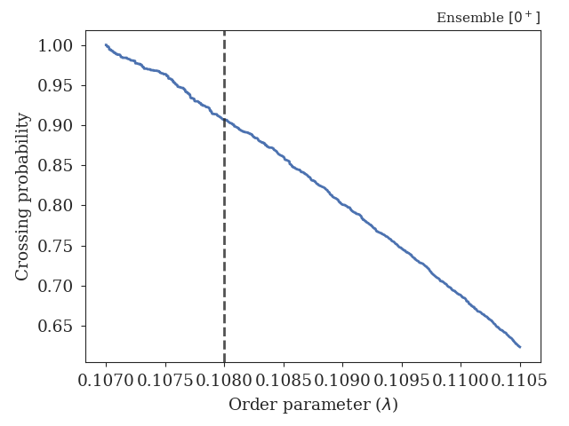
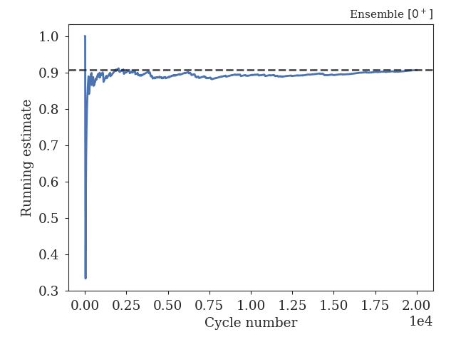
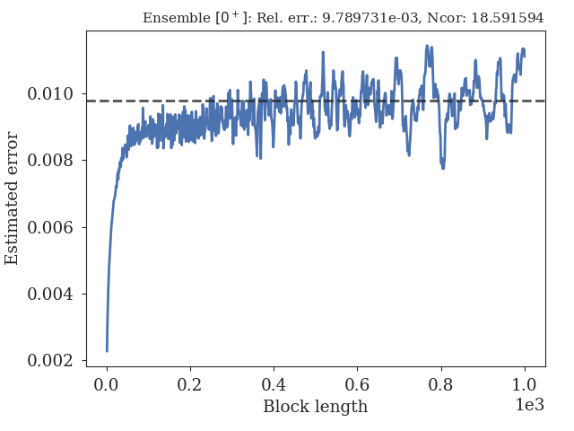

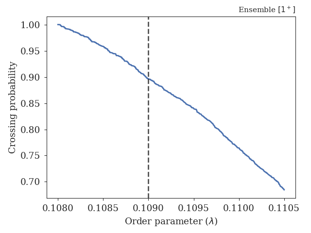
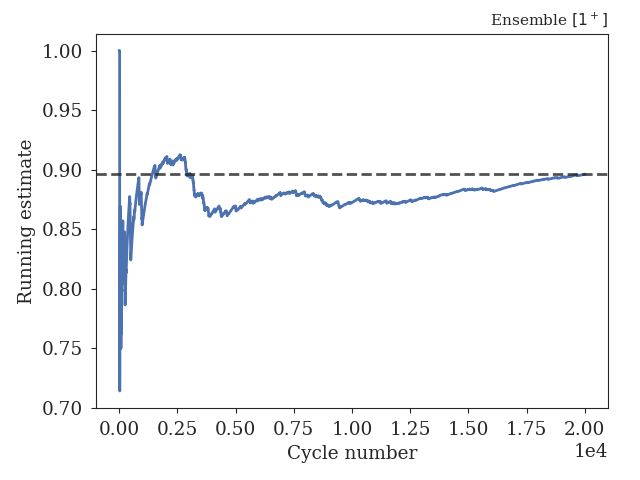
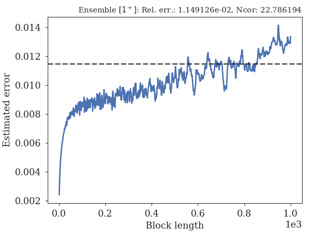

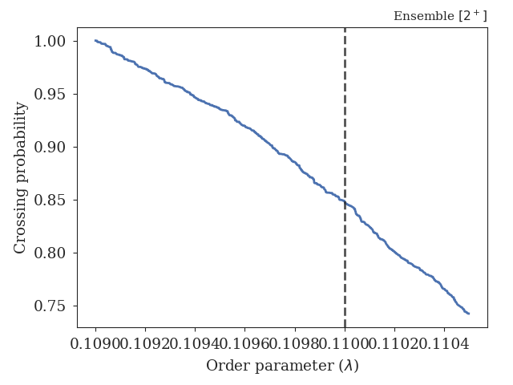
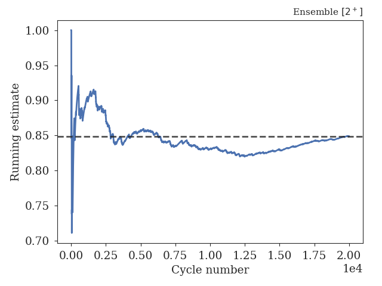
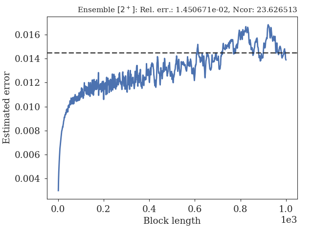

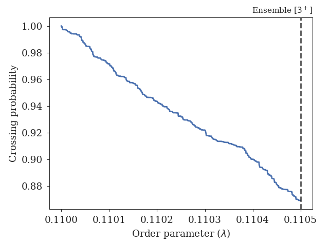
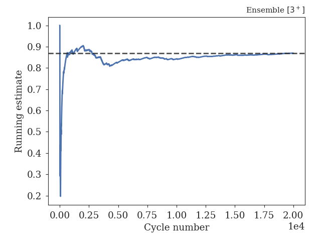
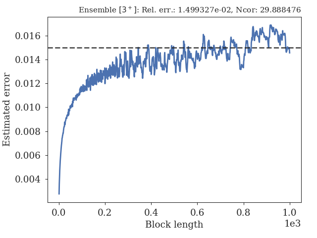

.. _len-shoot-figures-output:

Distributions for path lengths and shooting moves
-------------------------------------------------

The average path lengths in the different ensembles are given in
the table below and some distributions for the path lengths and
shooting moves can also be found here:

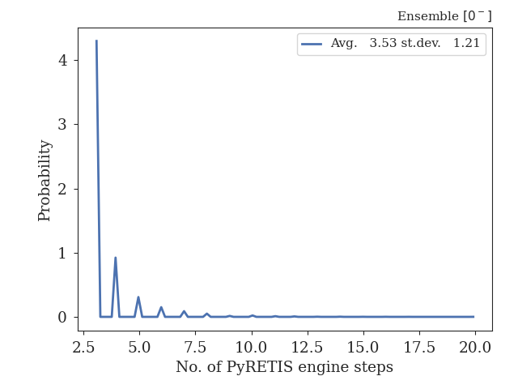
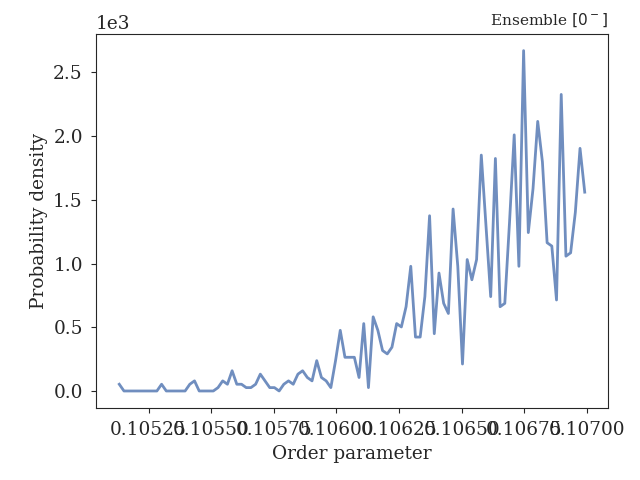

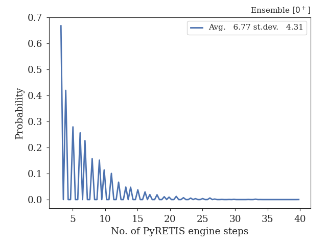
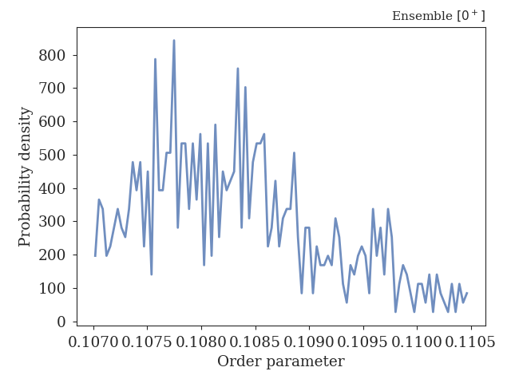

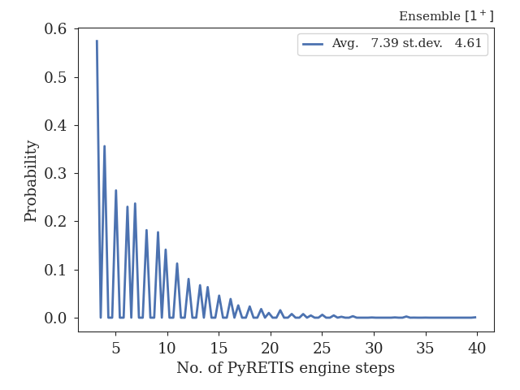
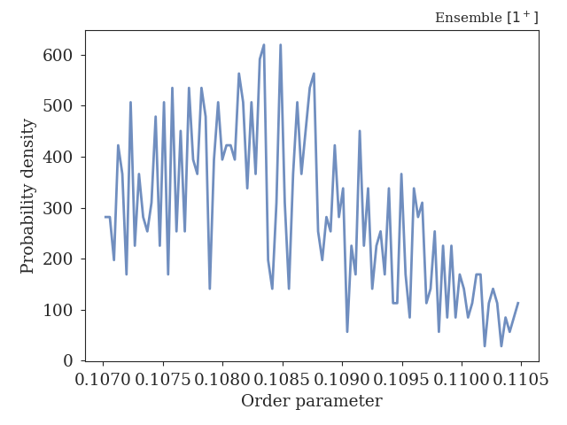

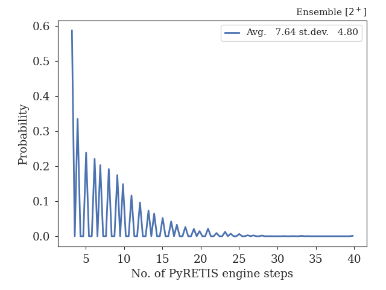
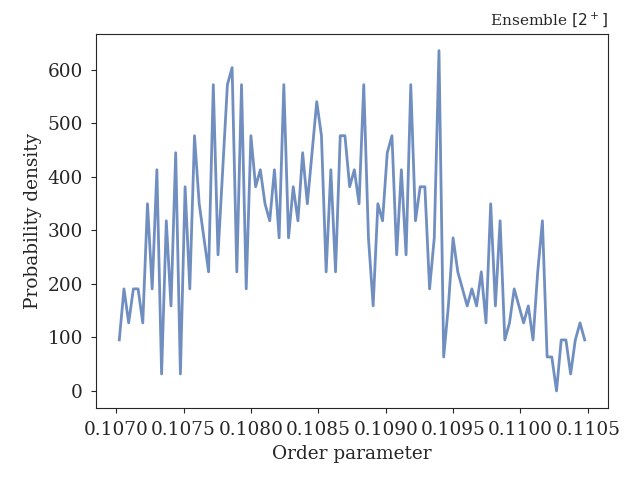

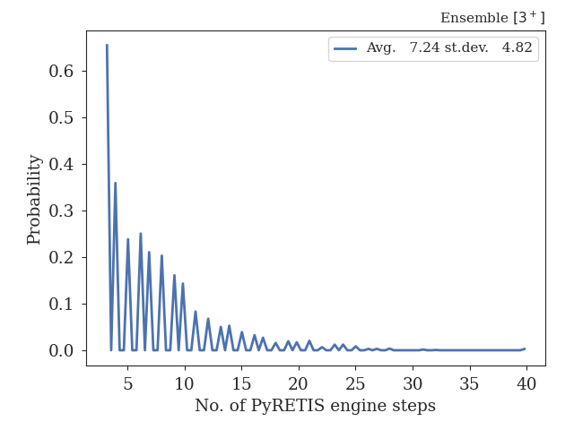
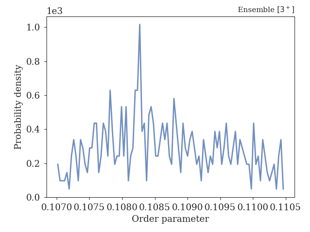

